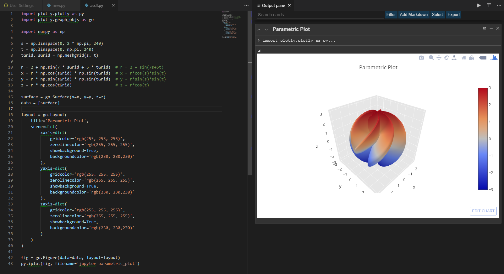

# VSNotebooks - New Fork
Want to install this for VSCode? https://marketplace.visualstudio.com/items?itemName=pavan.VSNotebooks

This is a fork from https://github.com/lorenzo2897/vscode-ipe. Hopefully I'll have time to add some cooler features!

### An Interactive Programming Experience for Data Scientists

**VSNotebooks** is a robust application that seamlessly combines the power of
Visual Studio Code with the interactivity of Jupyter Notebook.

## Development 
This plugin is under heavy active development. Want to help? Open an issue, and I can help you get started!
